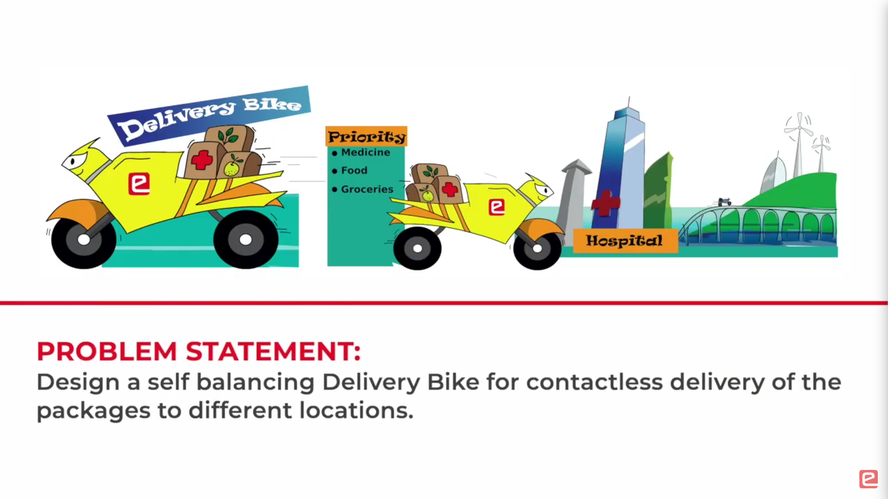
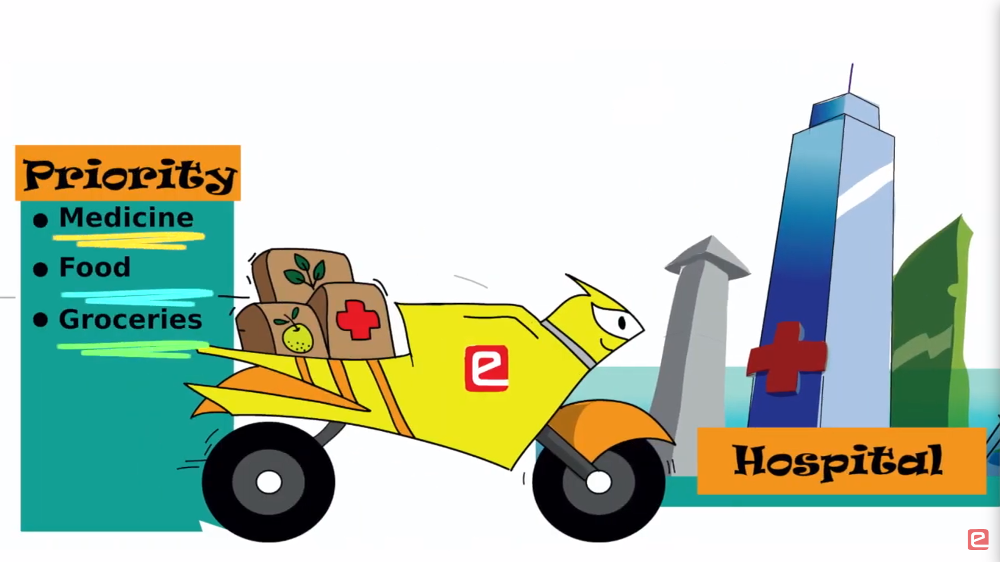
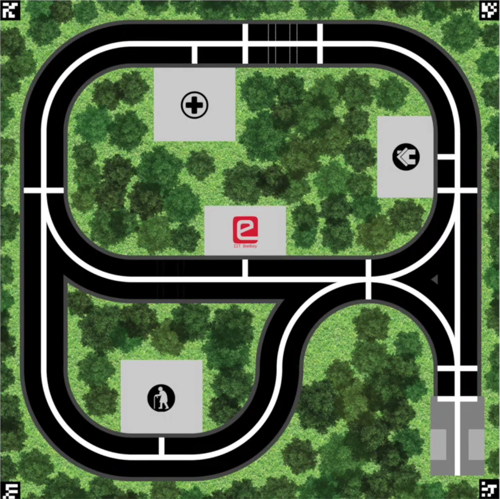
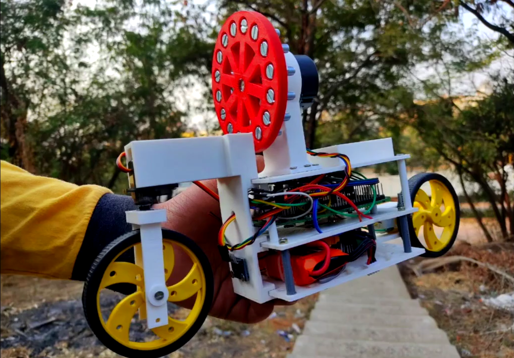

# Eyantra_DB-2887

### Theme Introduction:
In this theme, the team will develop a Self-Balancing Bike, which will deliver various items throughout the cityscape. The delivery order will be decided by the priority of the package, thus posing a challenge in path planning. While development, you will learn the basics of the Control System and LQR controller design. The main challenges faced in this theme will be:

- Balancing of 2-wheeled Delivery Bike.
- Autonomous Navigation of Delivery Bike.
- Pickup and delivery in the arena.

    
    

## Arena

## Self Balancing Bike

**Concepts used**:  
Self-Balancing Robot, State-Space Modelling, Euler-Lagrange Mechanics, Linear Quadratic Regulator, Lua Language, Octave Programming, Coppelia Sim, Fusion 360.

For sharing resources of the Delivery Bike project in eYRC 2021.

## Balancing Test

## Our Final Demo Video: 

## References
1. The official documentation for GNU Octave 5.2.0 is [here](https://octave.org/doc/v5.2.0/).
2. For task 1.1: The syntax for [solve](https://octave.sourceforge.io/symbolic/function/@sym/solve.html), [jacobian](https://octave.sourceforge.io/symbolic/function/@sym/jacobian.html), [subs](https://octave.sourceforge.io/symbolic/function/@sym/subs.html), and [eig](https://octave.sourceforge.io/octave/function/eigs.html) functions were taken from octave.sourceforge.io website.
3. [Research paper on LQR](https://www.kybernetika.cz/content/2015/1/173/paper.pdf)
4. [Coppeliasim User Manual](https://www.coppeliarobotics.com/helpFiles/)
5. [Control Systems Playlist](https://youtube.com/playlist?list=PLMrJAkhIeNNR20Mz-VpzgfQs5zrYi085m)

**Note**: This repo was made public after the competition ended, and final scripts were uploaded for future reference purposes.
